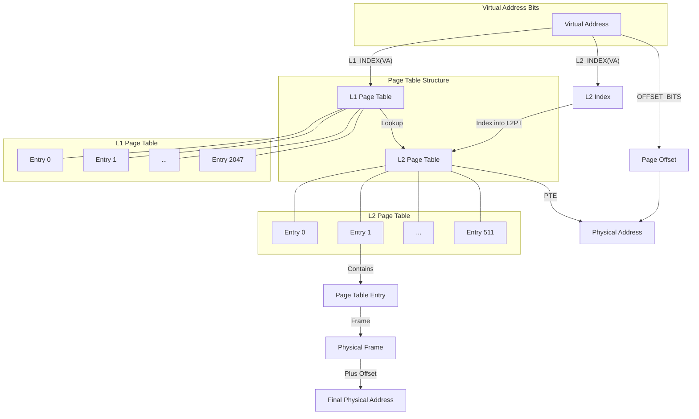
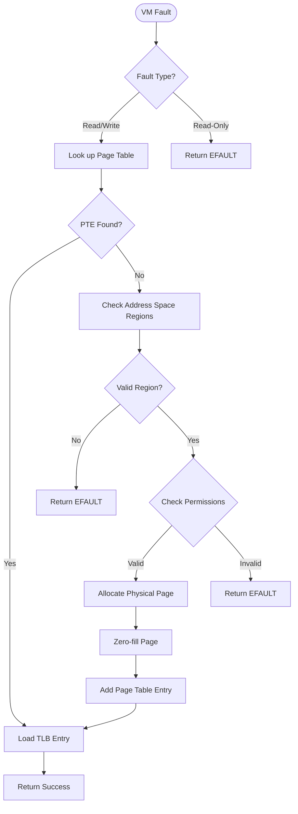
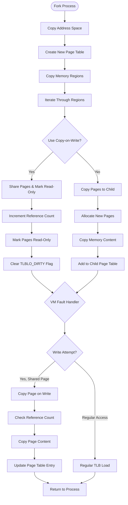

# OS/161: Educational Operating System

[](https://opensource.org/licenses/MIT)

OS/161 is an educational operating system designed for use in operating systems courses. It provides a simplified but realistic environment for implementing and understanding core operating system concepts.

## Overview

OS/161 is designed for implementing core operating system components:
- Process management
- Thread management
- Virtual memory
- File systems
- System calls
- Synchronization primitives

This educational OS runs on System/161, a machine simulator that emulates a simplified MIPS R3000 processor and provides various virtual devices.

## Custom Implementation Highlights

This fork features a custom implementation of several key operating system components:

### Virtual Memory System
- Two-level page table implementation for efficient memory management
- Dynamic page allocation on demand (demand paging)
- Memory permission management (read/write/execute)
- TLB management with proper invalidation

### Process Management
- Process forking with memory management
- Page table copying between parent and child processes
- Memory mapping for executable loading

### Implementation Details
- L1 and L2 page tables with hierarchical structure
- Page fault handling for on-demand page allocation
- VM fault handling with proper permission checking
- Memory regions with permission tracking
- Proper TLB shootdown mechanism

## System Architecture Diagrams

### Two-Level Page Table Structure


### VM Fault Handling Process


### Process Fork Memory Management


## Project Structure

- **kern/** - Kernel source code
  - **arch/** - Architecture-specific code (MIPS)
  - **conf/** - Kernel configuration
  - **dev/** - Device drivers
  - **fs/** - File system implementations
  - **include/** - Kernel header files
  - **lib/** - Kernel utility functions
  - **main/** - Kernel initialization
  - **proc/** - Process management
  - **syscall/** - System call implementations
  - **test/** - Kernel test code
  - **thread/** - Thread management
  - **vm/** - Virtual memory subsystem
  - **vfs/** - Virtual file system

- **userland/** - User programs and libraries
  - **bin/** - Basic user programs
  - **include/** - User-level header files
  - **lib/** - User-level libraries
  - **sbin/** - System utilities
  - **testbin/** - Test programs

- **mk/** - Build system files
- **common/** - Common components
- **design/** - Design documentation
- **man/** - Manual pages
- **testscripts/** - Automated test scripts

## Getting Started

### Prerequisites

- GCC MIPS cross-compiler
- Python (2.7 or later)
- System/161 simulator

### Building OS/161

1. Configure the build environment:
   ```
   ./configure --ostree=$HOME/os161/root
   ```

2. Build the OS/161 kernel:
   ```
   cd kern/conf
   ./config DUMBVM
   cd ../compile/DUMBVM
   bmake depend
   bmake
   bmake install
   ```

3. Build userland programs:
   ```
   cd userland
   bmake
   bmake install
   ```

### Running OS/161

Run the OS/161 kernel with:
```
cd $HOME/os161/root
sys161 kernel
```

## Development Tasks

OS/161 is designed for implementing various OS components as part of coursework:

1. **Synchronization primitives** - Implementing locks, semaphores, and condition variables
2. **System calls** - Adding basic system calls like read, write, and exit
3. **Process management** - Implementing process creation, execution, and termination
4. **Virtual memory** - Adding virtual memory with paging and TLB management
5. **File systems** - Implementing a simple file system

## Testing

The project includes various test programs in `userland/testbin/` that can be used to validate your implementations.

Automated test scripts are available in the `testscripts/` directory.

## Resources

- OS/161 was originally developed at Harvard University by David A. Holland
- The current version is maintained for educational use in operating systems courses

## Contributors

OS/161 was developed by David A. Holland with contributions from:
- Amos Blackman
- Alexandra Fedorova
- Ada T. Lim
- Georgi Matev
- Jay Moorthi
- Geoffrey Werner-Allen

Custom virtual memory implementation contributions by:
- Hongfei Yang - Two-level page table, virtual memory subsystem, process forking with memory management

And others as listed in the CHANGES file.

## License

OS/161 is distributed under an MIT-like educational license. 